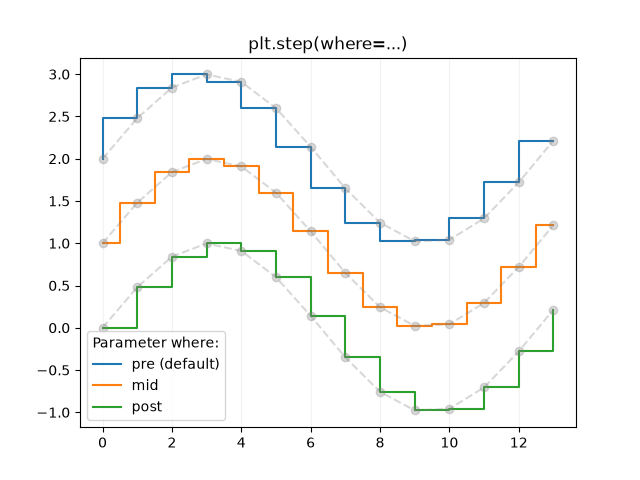

# Лабораторная работа №1. Использование метода численного интегрирования и визуализации

### Задание 1.

Ознакомиться с методом численного интегрирования "левые прямоугольники" (https://mathprofi.ru/metod_prjamougolnikov.html)

### Задание 2. 

В соответствии с вариантом, взять математическую функцию и произвести расчет определенного интеграла на указанном в варианте отрезке. Расчет выполнить с использованием библиотеки и ориентируясь на код:

```python
from scipy.integrate import quad

# Задаем функцию, например, f(x) = x^2
def integrand(x):
    return x**2

# Вычисляем интеграл от 0 до 3
result, error = quad(integrand, 0, 3)
print("Результат:", result) 
```

### Задание 3.

Реализовать метод серединных прямоугольников на Python и запустить программу для значений из варианта. Сравнить полученный результат с результатом из Задания2. Увеличивая число разбиений (на прямоугольники) достигнуть точности, аналогичной заданию 2.

### Задание 4.

Построить графики интегрируемой функции и ступенчатой аппроксимации, чтобы получилось приблизительно как в примере




### Варианты
